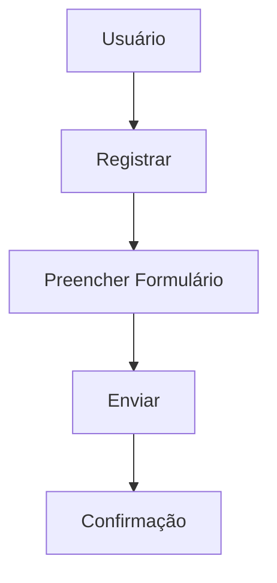
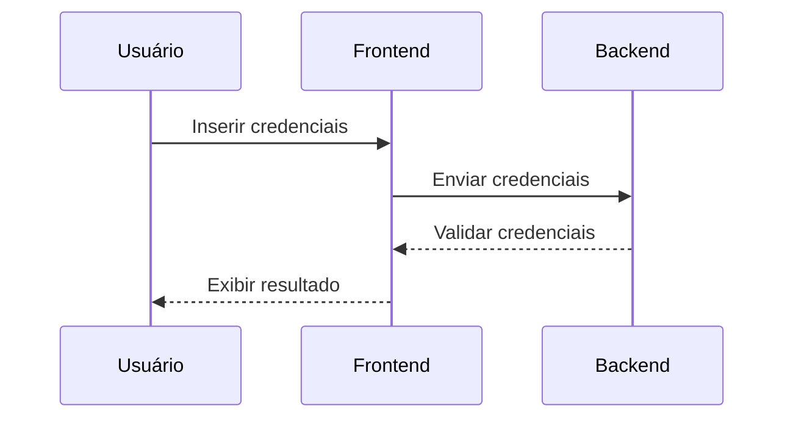
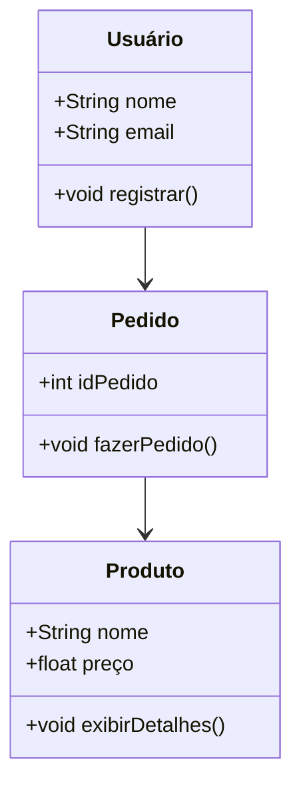
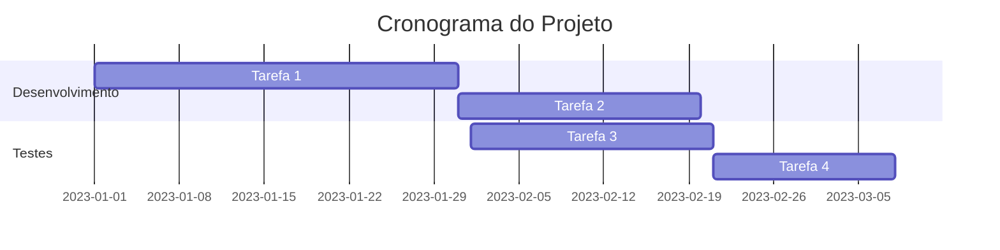
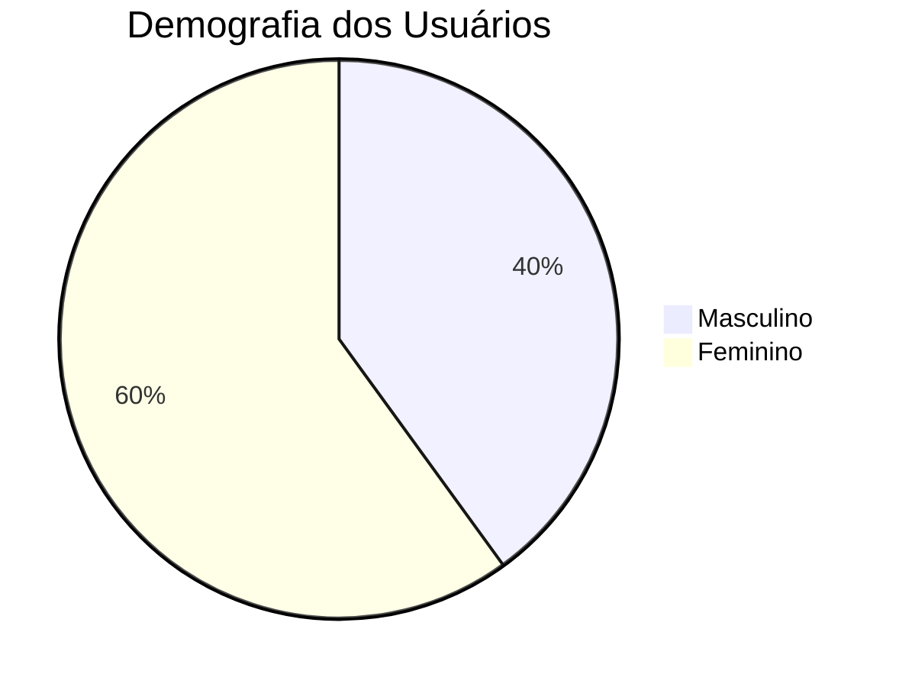
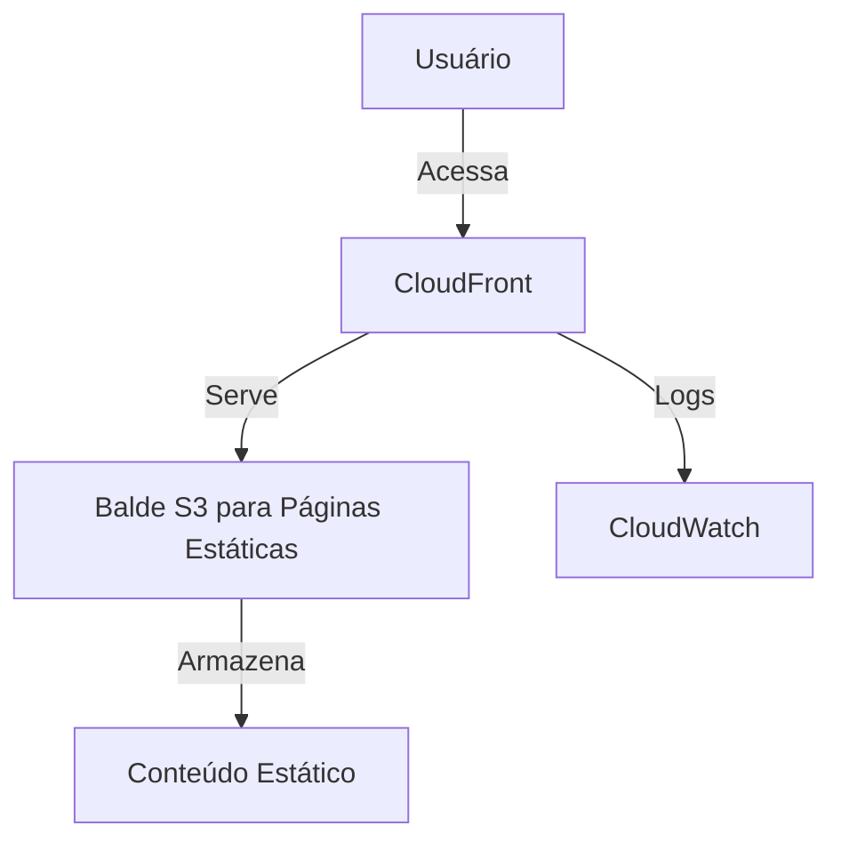

# Guia de Interação com Assistentes de IA

## Introdução

Este guia tem como objetivo ajudar você a interagir de forma mais eficaz com assistentes de IA, como o GitHub Copilot, para apoiar no desenvolvimento de software. Seguindo estas diretrizes, você poderá obter respostas mais detalhadas e úteis, acelerando seu aprendizado e a resolução de problemas.

## Dicas para Formular Perguntas

### Seja Específico

Quanto mais específica for a sua pergunta, mais detalhada e precisa será a resposta. Evite perguntas genéricas e forneça detalhes sobre o que você está tentando alcançar.

**Exemplo:**

- Pergunta Genérica: "Como faço isso?"
- Pergunta Específica: "Como faço para implementar autenticação JWT no Angular?"

### Forneça Contexto

Fornecer contexto adicional pode ajudar a obter respostas mais relevantes. Mencione o framework, a linguagem de programação e qualquer outra informação relevante.

**Exemplo:**

- "Estou usando Angular e preciso implementar autenticação JWT. Pode me ajudar com isso?"

### Use Palavras-chave

Usar palavras-chave específicas pode abrir um leque adicional de possibilidades. Aqui estão algumas palavras-chave úteis:

- **"Exemplo"**: Pedir um exemplo de código pode ajudar a entender melhor a implementação.
- **"Melhores práticas"**: Perguntar sobre melhores práticas pode fornecer insights sobre como fazer algo de forma eficiente e segura.
- **"Alternativas"**: Pedir alternativas pode ajudar a explorar diferentes abordagens para resolver um problema.
- **"Explicar"**: Pedir uma explicação detalhada pode ajudar a entender conceitos complexos.

**Exemplo:**

- "Pode me mostrar um exemplo de como usar o Angular Router para proteger rotas?"

### Descreva Cenários Específicos

Descrever cenários específicos pode ajudar a obter respostas mais direcionadas.

**Exemplo:**

- "Como faço para proteger uma rota no Angular usando um AuthGuard?"

## Estrutura Recomendada para Documentação de Projetos

Manter uma documentação clara e detalhada é essencial para o sucesso de qualquer projeto de software. Aqui está uma estrutura recomendada para documentar seus projetos:

### Visão Geral do Projeto

- **Título do Projeto**: Nome do projeto.
- **Descrição**: Breve descrição do projeto e seu propósito.
- **Objetivos**: Objetivos principais do projeto.

### Atores e Papéis

- **Atores**: Lista de atores (usuários, sistemas, etc.) envolvidos no projeto.
- **Papéis e Responsabilidades**: Descrição dos papéis e responsabilidades de cada ator.

### Funcionalidades

- **Funcionalidades Principais**: Lista das funcionalidades principais do sistema.
- **Requisitos Funcionais**: Detalhamento dos requisitos funcionais para cada funcionalidade.

### Requisitos Não Funcionais

- **Desempenho**: Requisitos de desempenho, como tempo de resposta e capacidade.
- **Segurança**: Requisitos de segurança, como autenticação e autorização.
- **Usabilidade**: Requisitos de usabilidade, como acessibilidade e facilidade de uso.

### Fluxos de Trabalho

- **Fluxos de Usuário**: Descrição dos fluxos de trabalho do usuário, incluindo diagramas de fluxo, se necessário.
- **Casos de Uso**: Casos de uso detalhados para cada funcionalidade.

### Arquitetura do Sistema

- **Visão Geral da Arquitetura**: Descrição da arquitetura do sistema.
- **Componentes Principais**: Lista e descrição dos componentes principais do sistema.
- **Diagrama de Arquitetura**: Diagrama visual da arquitetura do sistema.

### Plano de Implementação

- **Cronograma**: Cronograma de implementação com marcos importantes.
- **Recursos Necessários**: Lista de recursos necessários para a implementação.

### Plano de Testes

- **Estratégia de Testes**: Estratégia geral de testes.
- **Casos de Teste**: Casos de teste detalhados para cada funcionalidade.

### Manutenção e Suporte

- **Plano de Manutenção**: Plano para manutenção contínua do sistema.
- **Suporte**: Informações de suporte e contato.

## Exemplos de Perguntas Eficazes

### Implementação Específica

- "Como faço para implementar autenticação JWT no Angular?"
- "Pode me mostrar um exemplo de como usar o Angular Router para proteger rotas?"

### Melhores Práticas

- "Quais são as melhores práticas para gerenciar estado em uma aplicação React?"
- "Quais são as melhores práticas para estruturar um projeto Angular?"

### Alternativas

- "Quais são as alternativas ao Redux para gerenciamento de estado em React?"
- "Quais são as alternativas ao AWS Cognito para autenticação de usuários?"

### Explicação Detalhada

- "Pode explicar como funciona o ciclo de vida de um componente Angular?"
- "Pode explicar a diferença entre promessas e observáveis no JavaScript?"

## Seção de Q&A

### Diagramas Mermaid

O Mermaid suporta vários tipos de diagramas para visualizar arquiteturas de sistemas. Aqui estão alguns exemplos de como pedir diferentes tipos de diagramas Mermaid:

#### Fluxograma

**Q:** Como faço para criar um fluxograma no Mermaid para representar um processo de registro de usuário?

**A:**

Para criar um fluxograma no Mermaid para um processo de registro de usuário, você pode usar a seguinte sintaxe:

#### Diagrama de Sequência

**Q:** Como faço para criar um diagrama de sequência no Mermaid para representar um processo de login?

**A:**

Para criar um diagrama de sequência no Mermaid para um processo de login, você pode usar a seguinte sintaxe:

#### Diagrama de Classes

**Q:** Como faço para criar um diagrama de classes no Mermaid para representar um sistema de e-commerce simples?

**A:**

Para criar um diagrama de classes no Mermaid para um sistema de e-commerce simples, você pode usar a seguinte sintaxe:

#### Gráfico de Gantt

**Q:** Como faço para criar um gráfico de Gantt no Mermaid para representar um cronograma de projeto?

**A:**

Para criar um gráfico de Gantt no Mermaid para um cronograma de projeto, você pode usar a seguinte sintaxe:

#### Gráfico de Pizza

**Q:** Como faço para criar um gráfico de pizza no Mermaid para representar a demografia dos usuários?

**A:**

Para criar um gráfico de pizza no Mermaid para a demografia dos usuários, você pode usar a seguinte sintaxe:

#### Diagrama de Arquitetura AWS

**Q:** Como faço para criar um diagrama de arquitetura AWS no Mermaid para representar uma implantação de frontend com CloudFront e S3?

**A:**

Para criar um diagrama de arquitetura AWS no Mermaid para uma implantação de frontend com CloudFront e S3, você pode usar a seguinte sintaxe:

