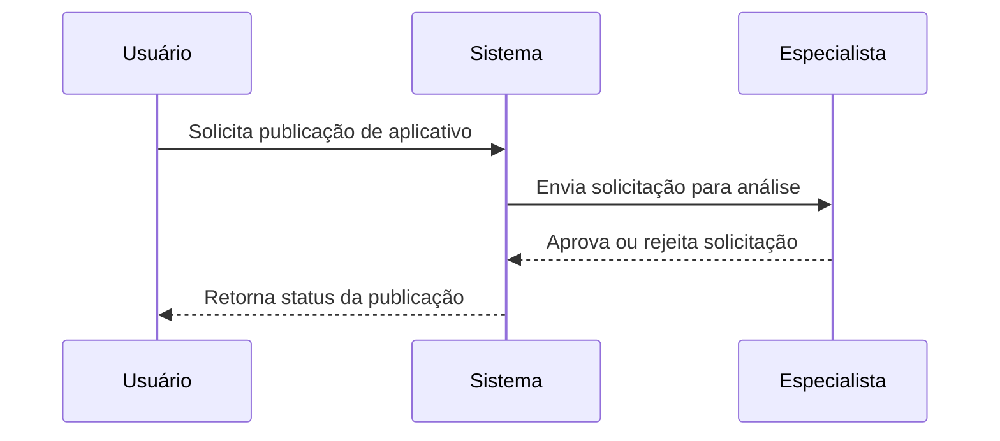
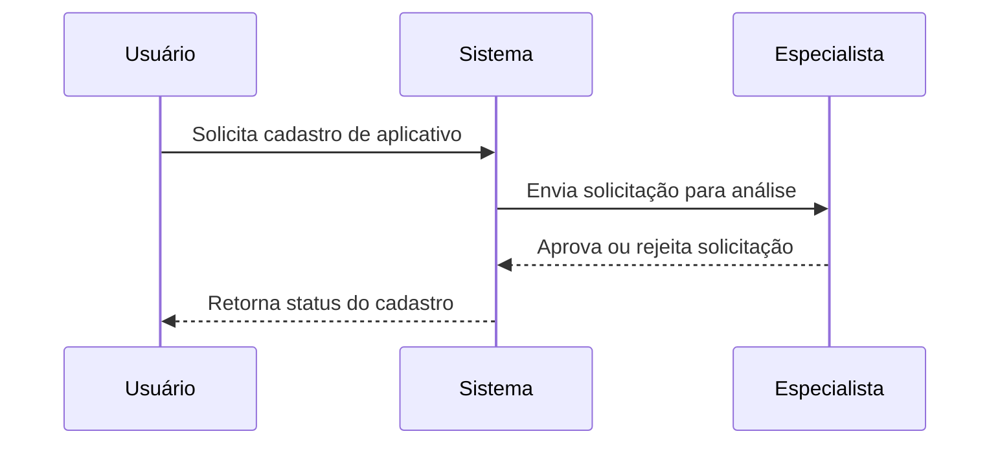
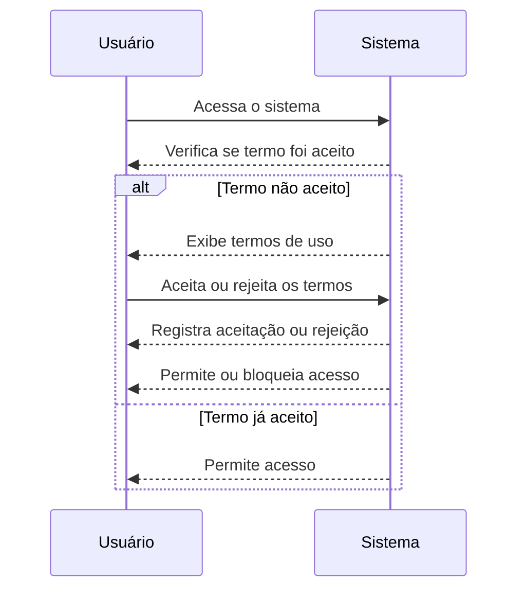

# Documentação do Projeto

## Jornadas do Projeto

### Jornada 1: Cadastro de Aplicativos
- **Descrição**: Permite que usuários de uma companhia solicitem o cadastro de novos aplicativos.
- **Atores**:
  - Usuário da Companhia
  - Especialista
- **Fluxo**:
  1. Usuário solicita o cadastro de um aplicativo.
  2. Especialista analisa e aprova ou rejeita o pedido.

### Jornada 2: Publicação de Aplicativos
- **Descrição**: Permite que aplicativos sejam publicados para dispositivos específicos.
- **Atores**:
  - Usuário da Companhia
  - Especialista
- **Fluxo**:
  1. Usuário solicita a publicação de um aplicativo.
  2. Especialista aprova ou rejeita a publicação.

### Jornada 3: Login e Autenticação
- **Descrição**: Garante que o conteúdo exibido seja referente à companhia logada.
- **Atores**:
  - Usuário da Companhia
- **Fluxo**:
  1. Usuário insere credenciais de login.
  2. Sistema autentica e exibe conteúdo relacionado à companhia.

### Jornada 4: Termo de Aceite
- **Descrição**: Permite que os usuários aceitem os termos de uso antes de prosseguir com o uso do sistema.
- **Atores**:
  - Usuário da Companhia
- **Fluxo**:
  1. Usuário acessa o sistema.
  2. Sistema verifica se o termo de uso já foi aceito.
     - **Condicional**: Se o termo não foi aceito, exibe a página de termos de uso.
     - Caso contrário, permite o acesso ao sistema.
  3. Usuário aceita ou rejeita os termos.
  4. Sistema registra a aceitação ou rejeição e permite ou bloqueia o acesso ao sistema.

## Diagramas de Sequência

### Diagrama de Sequência: Publicação de Aplicativos

### Diagrama de Sequência: Cadastro de Aplicativos

### Diagrama de Sequência: Termo de Aceite
